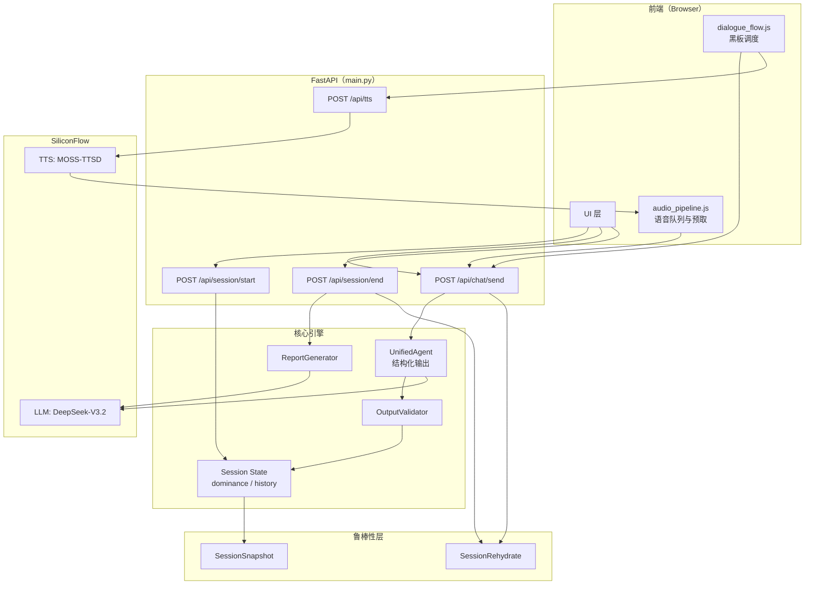
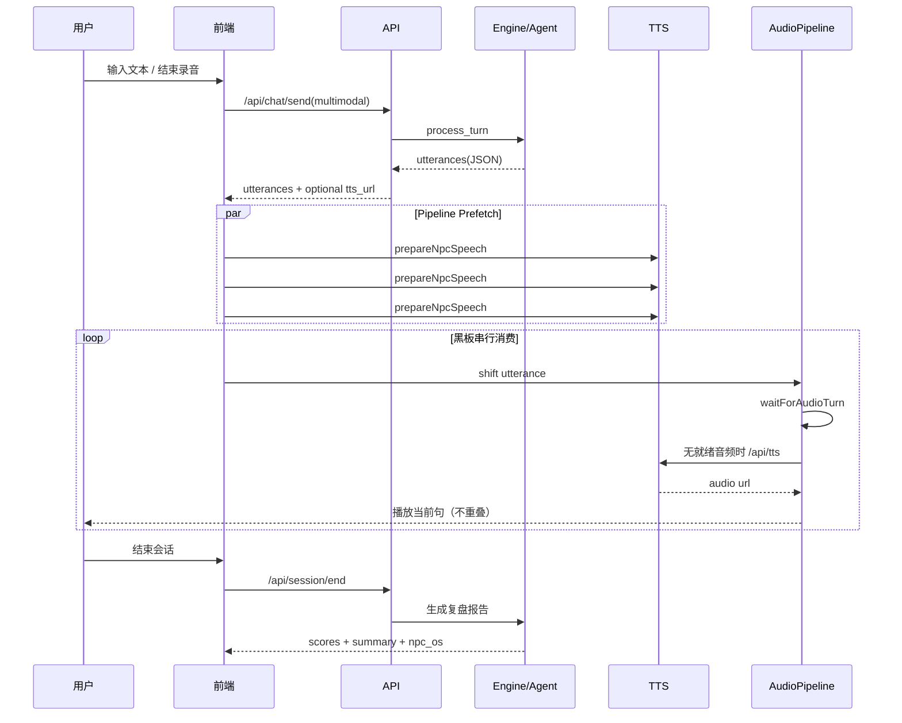

欢迎体验！访问网址：https://talk-arena.vercel.app/

1. 🎯 用户痛点与核心价值：
一句话定位：给年轻人的赛博表达训练营！
1.1 我们在解决什么问题？
- Z世代年轻人普遍存在“社交恐惧”、“社交焦虑”
- 缺乏在真实高压社交场景（如家庭饭桌、商务饭局、面试）中的实战经验
- 传统的社交技巧书籍与课程缺乏沉浸式体验，难以真正掌握
1.2 我们给出的解决方案？
不是简单的聊天机器人，而是社交训练模拟器，提供：
- 多场景覆盖：山东家庭饭桌、商务饭局、压力面试等
- 多模态互动：NPC自带声音、自动捕捉表情、支持语音输入
- 实时反馈：气场值变化、裁判点评、救场建议
- 复盘报告：多维度评分、综合点评、NPC内心OS
场景设置 → 训练 → 实时反馈 → 复盘报告 → 提升，完整闭环！
1.3 商业落地潜力
1. 商业模式规划
- 基础盈利模式：按token调用量设计多层会员体系
- 未来扩展方向：
  - 可拓展为职场新人培训、销售技能培训、秋招面试mock等产品
  - 可与市面上的社交表达、面试训练课程合作，作为课后训练工具
2. 市场竞争优势
- 聚焦表达能力，产品定位与迭代方向清晰
- 脑洞有趣新颖，自带话题度
增长策略可参考“青椒模拟器”，官方社媒账号运营+UGC传播
- 多模态AI调用，沉浸式对话场景，具有技术前瞻性

---
2. 💡 核心亮点
3个“多”重构对话体验！
2.1 多模态融合
- 多模态融合为统一情绪状态：文本 + 语音 + 表情，汇总为统一的MultimodalEmotionState
  - 语音提取声学特征（响度、语速等），表情提取情绪特征。能检测到用户“嘴上说没事，声音已经虚了，神态已经慌了”
- 连续过程，不是一次性判断：看情绪轨迹，而非某一时刻
2.2 多角色编排
- 一对多对话：不是简单的一对一聊天，而是用户面对多个分工明确的NPC，模拟真实社交场景中多人互动共同形成的压力
- 统一编排 & 多元人设：
  - 多个NPC在同一上下文中协作，避免各说各话
  - 同时不同角色有不同的性格、说话风格和目的
- 场景、角色可定制 ：用户可自定义对话场景、对话者身份性格，以及各场景的差异化设定（如施压侧重点、酒量值等）
2.3 多Agent协作
- 职责分层：决策、知识、校验分离，避免一个Agent包打天下
- 可扩展架构：支持逐步替换为更复杂的多Agent方案
- 工程化、模块化，分层架构支持灵活迭代
- 技术架构：
TalkArenaEngine
├── UnifiedAgent (主路径：统一编排多角色)
├── MultiAgentOrchestrator (备用：多Agent独立自治)
├── DecisionEngine (决策层)
├── RAGEngine (知识层)
└── OutputValidator (校验层)

---
3. ✨ 创意来源
紧跟网络热梗，追随热点产品，探索AI能力边界！
3.1 基于“社交”“表达”等关键词可联想网络热梗：
- 高频属性：在社媒中“高情商”与“山东人”关键词高频强绑定，具有社交传播力
- 实用属性：网友询问表达建议时在评论区得到的“高情商”回复具有实用性，让人联想到如果能让用户在一个应用中更即时的得到类似回复，将更有实用效果
3.2 已经得到市场验证的成功产品：
应用
课程
《青椒模拟器》：验证了用户对AI模拟社交的接受程度和需求强度
《黄执中表达训练课》：验证了用户对系统化提高表达能力的迫切诉求与付费意愿
[图片]

[图片]

3.3 众多优化prompt“调教”chatbot的成功案例：
- 用户视角：用户会采用不同的prompt让ChatGPT等chatbot形成不同的性格和人设与自己对话，满足自己的情感需求，将对话片段在社媒进行传播
- 应用层面：如“星野”等AI应用，可基于不同的人设生成不同的agent与用户对话

---
4. 👩 体验与交互设计
交互设计理念：
- 以用户体验为起点设计功能链路，调用 AI 能力优化交互体验。而不是先有 AI 能力，再反向拼凑产品功能。
- AI 能力深度融合在功能链路的每一处细节中，而非生硬地挂在功能上。
4.1 场景化设计：针对不同场景定制策略
- 用户可快速进入AI 生成的饭局场景，也可深度自定义，兼顾轻量性与可玩性、灵活性
4.2 高仿真的输入与交互机制
- 支持语音转文字：语音输入后立即转成文字，用户可以确认或修改
- 实时捕捉表情、语气：同时捕捉用户的言与行，还原真实社交压力
- 用户可以打断NPC发言，模拟真实社交场景
- 实时救场引导：大模型能基于当前语境，为用户生成最高情商的“参考答案”
4.3 多角色时序：逐条展示，营造真实感
- 逐条展示：前端按顺序逐个显示NPC发言
- 延迟控制：每个NPC发言之间有延迟
4.4 局后复盘：完整的训练闭环
- 一键生成：对话结束后，一键生成完整复盘报告，实现从实践到反馈再到提升的学习闭环
- 多维度展示：
  - 量化分数：圆滑度、亲和力、逻辑性、幽默感、懂规矩
  - 综合点评：LLM生成的详细点评
  - NPC内心OS：每个NPC对你的真实看法
- 社交裂变：总结报告内容丰富、视觉美观，可直接下载或扫描二维码保存分享

---
## 5. 技术架构说明

### 5.1 端到端主链路

- 会话建立：`/api/session/start` 写入场景、角色、压力参数、回合状态。
- 对话推进：`/api/chat/send` 进入 `TalkArenaEngine -> UnifiedAgent`。
- 结果落地：返回结构化 `utterances`，前端按黑板顺序渲染并播报。
- 局后总结：`/api/session/end` 基于 transcript 生成评分、点评、NPC 内心 OS 与建议。

### 5.2 LLM 选型与稳定性策略
- 默认模型：`deepseek-ai/DeepSeek-V3.2`（通过 SiliconFlow OpenAI 兼容路由）。
- 选型重点：中文对话质量、角色一致性、结构化输出稳定性。
- 结构化输出策略：
  - 优先 `json_schema` 严格约束输出。
  - 不支持时退化为 `json_object`。
  - 长度截断时自动加大 token budget 重试。
  - 解析失败走修复/再生成路径，降低 JSON 崩溃导致的中断。

### 5.3 多模态机制：表情如何影响 NPC
- 前端上传的是汇总后的多模态信号（如 `emotion`、`voice_features`、`voice_text`），不是原始视频帧。
- 当前版本中，多模态主要影响“反馈层/评估层”：
  - 返回 `multimodal_analysis` 给前端展示。
  - 参与压力应对、表达质量等维度评估。
- NPC 主发言生成仍以“场景约束 + 角色设定 + 对话历史 + 压力参数”为主，以保证角色扮演稳定。

### 5.4 TTS 实现与角色映射
- 调用链：前端 `POST /api/tts` -> 服务端 `SiliconFlowTTSService.synthesize` -> SiliconFlow `audio/speech`。
- 语音选择优先级：
  1. 显式 `voice`
  2. 角色 `tts_voice`
  3. 角色 `tts_role / tts角色`
  4. 预设角色映射 + 性别/年龄映射
  5. 稳定哈希选声 + emotion fallback
- 固定开场句支持 `fixed_*.mp3` 缓存，降低首轮等待。
- 前端播放优先消费后端回传 `utterance.tts_url`，未命中再请求实时 TTS。

### 5.5 性能优化：文字到语音的延迟治理
- 启动预热：服务启动时预热 LLM/TTS，并支持远端 TTS 预热。
- 开场预构建：`session/start` 阶段尽量附带可直接播放的 `tts_url`。
- 流水线预取（Pipeline Prefetch）：
  - 一轮 `utterances` 到达后，前端立即并发 `prepareNpcSpeech`。
  - 每条 utterance 绑定 `_preparedAudioPromise`，播放阶段直接消费。
- 播放策略：`npcSpeechQueue + waitForAudioTurn` 保证严格串行，不允许语音重叠。
- 观测指标：
  - `[ChatSend]`：LLM 生成耗时、带 `tts_url` 比例
  - `[TTSAPI]`：服务端 TTS 耗时
  - `[TTSClient]`：前端命中缓存/待处理中
  - `[SpeechLatency]`：从文本到音频起播的端到端延迟

### 5.6 Agent 黑板机制（时序与可控性）
- 黑板结构：`utteranceBlackboard` 保存当前轮 NPC 发言单元（speaker/text/delay/tts_url）。
- 消费规则：`displayUtterances()` 每次 `shift` 一条，确保“文本顺序 = 语音顺序”。
- 中断/继续：
  - `interrupt` 清空黑板与语音队列，防止旧轮次残留。
  - `continue` 拉取新 utterances 回填黑板后继续播放。
- 价值：实现“生成并发准备、播出严格时序”的可控交互体验。

### 5.7 鲁棒性：无状态部署下的会话恢复
- 问题：Vercel 等无状态多实例环境会导致内存会话丢失。
- 现有方案：
  - Session Snapshot：会话快照落盘。
  - Session Rehydrate：会话 miss 时用前端回传 `chat_history + 场景信息` 重建。
- 覆盖入口：`send / interrupt / continue / rescue / end`。
- 结果：显著降低“会话不存在”硬失败概率，保证报告链路可续。

### 5.8 安全与隐私边界
- 表情数据：仅前端本地处理，不上传原始视频帧、截图、人脸图像。
- 语音数据：仅在用户主动结束录音后上传短音频用于 STT。
- 密钥管理：模型密钥仅在服务端环境变量中使用，不下发前端。
- 分享边界：报告分享是用户显式触发操作，生成公网链接后可访问；生产环境应避免写入敏感隐私信息。

---
6. 🔭 未来展望
本项目目前落地的“家庭饭桌试炼”“商务饭局谈判”“群面竞争场”仅是“赛博社交场”的部分先导模块。我们的技术架构具有高度通用性，未来可以轻松拓展至更多场景：
- 严肃工具场景： 工作汇报、项目答辩等
- 情感支持场景： 破冰交友、伴侣矛盾等
我们的未来愿景，是打造一个全场景的社交实验室，全面提升用户的社会化能力！